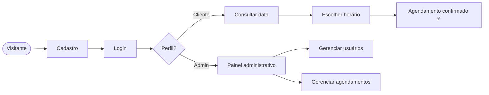

<div align="center">

# 🎨 Estúdio

### Sistema de Agendamentos para Estúdios

_Cadastre-se, escolha seu horário e pronto. Sem conflitos, sem confusão._


[Funcionalidades](#-funcionalidades) •
[Instalação](#-instalação) •
[Como usar](#-como-usar) •
[Rotas](#-mapa-de-rotas) •
[Problemas comuns](#-solução-de-problemas)

</div>

---

## 💡 Sobre o projeto

O **Estúdio** é uma aplicação web feita em **Python + Flask** para gerenciar os agendamentos de um estúdio. Clientes criam conta, fazem login e reservam horários com **verificação de conflitos em tempo real**. Já os administradores têm um painel exclusivo para controlar usuários e agendamentos.



---

## 🚀 Funcionalidades

<table>
<tr>
<td width="50%" valign="top">

### 👤 Para clientes

- 🔐 **Cadastro e autenticação** com login, logout e controle de sessão
- 📅 **Agendamento** com data, hora de início e término
- ⚡ **Verificação de conflitos** em tempo real
- 📋 **Meus agendamentos**: visualize e cancele quando quiser
- 🧑 **Perfil**: veja e edite seus dados ou exclua sua conta

</td>
<td width="50%" valign="top">

### 🛡️ Para administradores

- 🖥️ **Painel administrativo** com área restrita
- 👥 **Gestão de usuários**: lista completa e exclusão
- 🗓️ **Gestão de agendamentos**: visão geral de todo o estúdio e cancelamento

</td>
</tr>
</table>

---

## 🛠️ Tecnologias

| Camada             | Tecnologia                       |
| ------------------ | -------------------------------- |
| **Backend**        | Python, Flask                    |
| **Banco de dados** | MySQL (`mysql-connector-python`) |
| **Frontend**       | HTML, CSS, templates Jinja2      |

> 🤖 **Transparência:** o **frontend** (templates HTML, CSS e páginas) e os scripts **`install.sh`** e **`run.sh`** foram **gerados por IA**. O backend e a lógica de negócio são o foco do projeto.

---

## ⚙️ Pré-requisitos

- 🐍 Python **3.8+**
- 🗄️ MySQL Server **5.7+** ou MariaDB **10.3+**
- 📦 pip

---

## 📦 Instalação

### ⚡ Opção 1: Automática (recomendada)

```bash
chmod +x install.sh
./install.sh
```

### 🔧 Opção 2: Manual

<details>
<summary><b>Clique para ver o passo a passo</b></summary>

<br>

**1. Acesse a pasta do projeto**

```bash
cd msbn-estudio
```

**2. Crie e ative um ambiente virtual** _(recomendado)_

```bash
python3 -m venv venv
source venv/bin/activate   # Linux/macOS
venv\Scripts\activate      # Windows
```

**3. Instale as dependências**

```bash
pip install -r requirements.txt
# ou, manualmente:
pip install flask mysql-connector-python
```

**4. Crie o banco de dados**

```bash
mysql -u root -p < db.sql
```

Ou, dentro do cliente MySQL:

```sql
SOURCE db.sql;
```

**5. Ajuste a conexão** _(se necessário)_ em `conexao.py`:

```python
con = mysql.connector.connect(
    host='localhost',
    database='estudio_db',      # nome do banco criado no db.sql
    user='root',
    password='sua_senha_aqui',  # senha do seu MySQL
    use_pure=True
)
```

</details>

---

## ▶️ Como executar

**Com o script:**

```bash
chmod +x run.sh
./run.sh
```

**Manualmente:**

```bash
source venv/bin/activate   # se estiver usando ambiente virtual
python main.py
```

🌐 A aplicação estará disponível em **http://localhost:5000**

---

## 🌐 Como usar

### 🔑 Credenciais de teste

| Perfil                      | E-mail                                    | Senha                |
| --------------------------- | ----------------------------------------- | -------------------- |
| 🛡️ **Administrador** (ID 1) | `admin@estudio.com`                       | `admin123`           |
| 👤 **Cliente**              | qualquer usuário cadastrado (exceto ID 1) | definida no cadastro |

> ⚠️ Troque essas credenciais antes de colocar o sistema em produção.

### 👤 Fluxo do cliente

1. **Cadastre-se** em `/pagina_cadastro` (nome, e-mail, telefone e senha)
2. **Entre** em `/loguin`
3. Vá em **Agendar** (`/pagina_consulta_agend`)
4. Escolha uma **data** e clique em **Consultar**
5. Selecione um **horário disponível**
6. Defina **hora de início e término**
7. **Confirme** ✅

### 🛡️ Fluxo do administrador

1. Faça login com `admin@estudio.com`
2. Você será redirecionado automaticamente para `/pagina_admin`
3. Dali, gerencie usuários e agendamentos pelos botões de listagem

---

## 🗺️ Mapa de rotas

| Rota                     | Descrição                    | Acesso     |
| ------------------------ | ---------------------------- | ---------- |
| `/`                      | Página inicial               | 🌍 Público |
| `/landing`               | Landing page                 | 🌍 Público |
| `/pagina_cadastro`       | Cadastro de usuário          | 🌍 Público |
| `/loguin`                | Login                        | 🌍 Público |
| `/pagina_consulta_agend` | Consultar e agendar horários | 👤 Cliente |
| `/perfil_user`           | Perfil do usuário            | 👤 Cliente |
| `/pagina_edit_user`      | Edição de dados pessoais     | 👤 Cliente |
| `/pagina_admin`          | Painel administrativo        | 🛡️ Admin   |
| `/pagina_listagem_users` | Listagem de usuários         | 🛡️ Admin   |
| `/pagina_listagem_agend` | Listagem de agendamentos     | 🛡️ Admin   |

---

## 📁 Estrutura do projeto

```
msbn-estudio/
├── main.py              # Aplicação Flask (rotas)
├── conexao.py           # Conexão com o MySQL
├── db.sql               # Criação do banco e das tabelas
├── requirements.txt     # Dependências Python
├── install.sh           # Instalação automática (gerado por IA)
├── run.sh               # Execução (gerado por IA)
├── templates/           # Templates Jinja2 (gerados por IA)
│   ├── static/css/styles.css
│   └── *.html
└── md/                  # Documentação adicional
```

---

## 🔧 Configuração para produção

Defina as variáveis de ambiente:

```bash
export FLASK_SECRET_KEY="sua_chave_secreta_super_segura"
export DB_HOST="localhost"
export DB_NAME="estudio_db"
export DB_USER="root"
export DB_PASSWORD="sua_senha_segura"
```

E altere `main.py` e `conexao.py` para lerem esses valores com `os.environ.get()`.

### 🔒 Checklist de segurança

- [ ] Trocar a chave secreta padrão
- [ ] Definir uma senha forte no MySQL (nunca vazia)
- [ ] Alterar as credenciais do administrador
- [ ] Usar HTTPS
- [ ] Armazenar senhas com hash (ex.: **bcrypt**)

---

## 🐛 Solução de problemas

<details>
<summary><b>❌ Erro de conexão com o MySQL</b></summary>

<br>

Verifique se o serviço está rodando:

```bash
sudo systemctl status mysql        # Linux
brew services list | grep mysql    # macOS
```

Inicie se necessário:

```bash
sudo systemctl start mysql
```

</details>

<details>
<summary><b>🚫 Access denied for user 'root'</b></summary>

<br>

Confira a senha em `conexao.py` ou crie um usuário dedicado:

```sql
CREATE USER 'estudio_user'@'localhost' IDENTIFIED BY 'senha_segura';
GRANT ALL PRIVILEGES ON estudio_db.* TO 'estudio_user'@'localhost';
FLUSH PRIVILEGES;
```

</details>

<details>
<summary><b>🔌 Porta 5000 já em uso</b></summary>

<br>

```bash
lsof -ti:5000 | xargs kill -9
```

Ou mude a porta no `main.py`:

```python
app.run(debug=True, port=5001)
```

</details>

<details>
<summary><b>📦 Módulo não encontrado</b></summary>

<br>

```bash
pip install -r requirements.txt --force-reinstall
```

</details>

---

## 📝 Licença

Este projeto é de uso livre.

<div align="center">

Feito com ☕ e Flask

</div>
